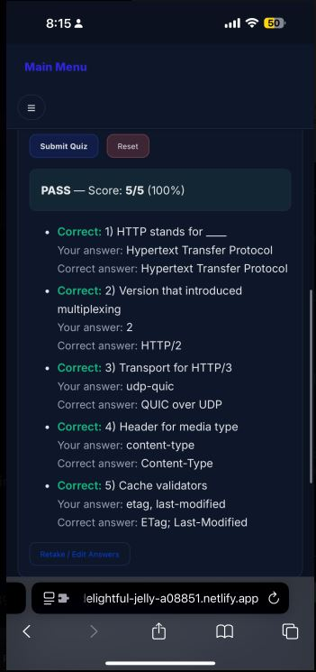

# Project report
### IT 3203 – Web Development | Milestone Project 3  
**Author:** Ceejay Raut  
**Live Site:** https://idcceejay.github.io/milestone_3/  
**Repository:** https://github.com/idcceejay/milestone_3.git  

## Overview
This project is a multi-page educational website explaining the evolution of HTTP — from its origins at CERN to modern HTTP/3 over QUIC. The site includes history, version comparisons, key concepts, diagrams, tables, and an interactive quiz.

## Pages Included
- index.html — Home  
- http-history.html — History of HTML
- http-versions.html — Versions + embedded essay  
- key-concepts.html — Key concepts  
- references.html — Sources  
- about.html — About + embedded resume  
- quiz.html — Interactive quiz  

## Features
### Modern UI / UX
- Unified stylesheet  
- Responsive layout  
- Hero banner  
- SVG illustrations  
- Accessibility features  

### Technical Highlights
- Semantic HTML  
- ARIA roles  
- Custom quiz JS engine  
- Comparison tables  
- Embedded PDF essay  
- Main Menu feature available on every page

## Milestone 3 – Project Report
### 1. Design Principles & Best Practices
- Mobile-first responsive design  
- CSS Grid + Flexbox  
- High-contrast accessible color palette  
- Skip links & ARIA labels  
- Responsive hero background  

### 2. Technical Features
A single unified stylesheet using:
- Design tokens (colors, spacing, typography)
- Reusable card components
- Theme-aware panels and shadows
- Custom banner + hero system  

Organized CSS with design tokens: 
- Tokens
- Base styles
- Navigation
- Cards
- Tables
- Notes & banners
- Footer
- Responsive adjustments

JavaScript quiz engine 
- Fully custom quiz engine:
- Auto-grading
- Summaries per question
- Required fields validation
- Multi-select scoring
- Immediate feedback
- Reset capability 

### 3. Testing
- Desktop, mobile, and tablet  
- Navigation, quiz scoring, PDF loading  
- Mobile menu transitions  

### 4. Research Summary
This project includes extensive research on the evolution of HTTP, covering:
- Origins at CERN
- HTTP/0.9 → HTTP/1.0 → HTTP/1.1
- Modernization with HTTP/2
- QUIC and HTTP/3
- Core concepts (methods, caching, headers, TLS, CDN practices)

### 5. References
- Hypertext Transfer Protocol (HTTP).: *Mozilla*
- 25 Years of the World Wide Web: *The Independent*
- History of the Web: *Web Foundation*
- HTTP Semantics: *IETF*
- What Is a Web Server?: *Mozilla*
- The History of the URL: *Cloudflare Blog*
- Web Server Survey: *Netcraft*
- Global Browser Market Share: *StatCounter*
- HTTP/3: The Past, Present, and Future: *Cloudflare Blog*
- How the Web Works: *Computer History Museum.*

### 6. Code Quality
- Clean indentation
- Well-structured HTML
- Meaningful class names
- External CSS & JS files
- Comments on major sections
- Proper separation of concerns
- Efficient use of variables and reusable components
- No unnecessary duplication  

### 7. Learnings
- HTTP evolution  
- Modern networking concepts  
- Responsive and accessible design  
- Deployment to GitHub Pages  

## 📱💻 Responsive Design Demonstration

  <strong>Mobile & Desktop Views of the Web Evolution Project</strong>

### 📱 Mobile View (iPhone)

  

  <em>
    An iPhone screenshot shows the new responsive CSS and layout logic in use
    (flexbox, CSS grid, media queries, mobile-nav toggle) customization makes the website responsive and accessible on all devices.
    to smaller screen sizes. The quiz, navigation menu, spacing, and typography adjust to these sizes.
    confirming the site is now meeting the Milestone 3 requirement for mobile use.
  </em>

---

### 🖥️ Desktop View

  

  <em>
    Desktop rendering remains clean, consistent, and aligned with the project’s design system.
    Both views confirm full responsiveness across devices.
  </em>

